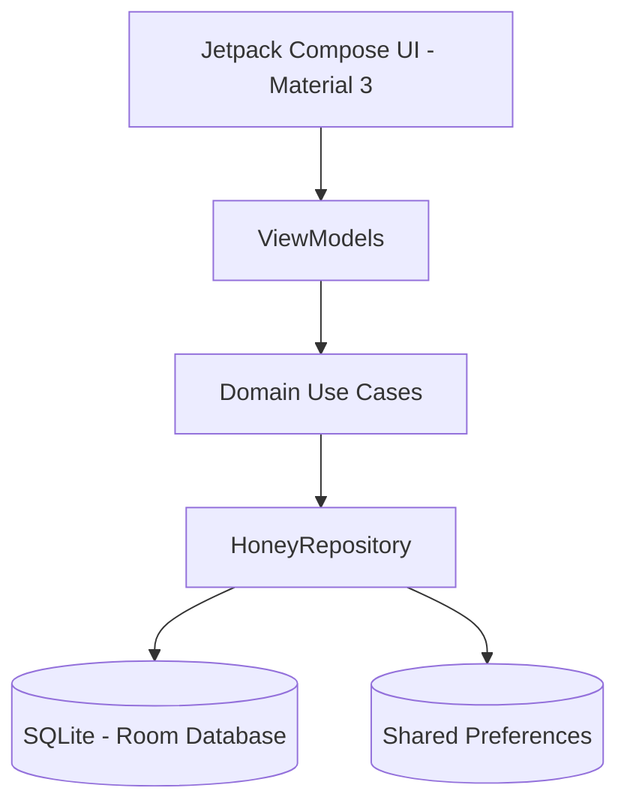

# Product Requirement Document (PRD) — JenuGumpu Honey Tracking App

## 1. Overview & Strategy
**JenuGumpu** (meaning *"Honey Collective"* in Kannada) is an offline-first, vernacular-ready Android mobile application built for rural honey producers, beekeeping collectives, and rural agricultural communities in Karnataka, India. 

### 1.1 Problem Statement
Smallholder beekeepers and rural honey collectives lack the digital tools to log harvests, track batch quality (color and moisture), and calculate profits accurately. This makes it difficult to maintain traceability and exposes them to middleman exploitation during sales.

### 1.2 Core Objective
Empower honey producers to digitize their inventory records, evaluate and log batch quality indicators, calculate exact profit margins based on active stock, and customize the experience in their preferred language (Kannada/English).

---

## 2. Target Personas
1. **Rural Honey Producer (Beekeeper)**
   - **Characteristics**: Manages multiple bee boxes, harvests seasonally, operates primarily offline in fields, and prefers vernacular languages (Kannada).
   - **Needs**: Simple logging, automatic batch ID generation for labeling jars, and profit estimation calculators.
2. **Cooperative/Collection Manager**
   - **Characteristics**: Collects harvests from multiple beekeepers across villages, checks batch quality parameters, and tracks aggregate quantities.
   - **Needs**: Summary dashboard, batch editing capabilities, and location-based filtering.

---

## 3. Product Architecture & Technical Scope

### 3.1 Tech Stack
- **UI Toolkit**: Jetpack Compose (Material 3 styling with Light/Dark mode).
- **Architecture**: MVVM with Clean Architecture separation (Data, Domain, Presentation).
- **Dependency Injection**: Dagger Hilt.
- **Local Database**: Room DB (SQLite) for offline-first logging.
- **State Management**: Kotlin Coroutines Flow.
- **Localization**: Custom wrapping of base Context for runtime locale shifting.

---

## 4. Feature Requirements

### 4.1 Home Dashboard Screen
*Allows users to see inventory summaries and pricing insights at a glance.*
- **Total Stock Indicator**: Aggregated sum of all quantities logged in the database (`Double` value formatted to kg).
- **Total Batches Indicator**: Count of all batch entries logged.
- **Market Price Insight Card**: Visual representation of current market prices (Wholesale vs Retail).
- **Educational Snippets**: Rotating beekeeping/direct-marketing tips.
- **Recent Activity**: Display of the 3 most recently logged harvests.

### 4.2 Harvest Input Screen
*The core ingestion point for logging new honey batches.*
- **Harvest Date Picker**: Opens a calendar dialog, logging timestamps as epoch milliseconds.
- **Location Input**: Text field for logging geographic hive locations.
- **Quantity Input**: Numerical field capturing batch weight in kilograms.
- **Floral Source Selector**: Exposed dropdown selection mapping to enum values:
  - `COFFEE_BLOSSOM` (Coffee Blossom Honey)
  - `WILDFLOWER` (Wildflower Honey)
  - `FOREST_HONEY` (Forest Honey)
- **Quality Indicators**:
  - **Grade Color**: Light, Amber, or Dark.
  - **Moisture Level**: Low, Medium, or High.
- **Batch ID Generator**: Automated sequential naming scheme formatting: `HNY-<YYYY>-<SEQ>` (e.g., `HNY-2026-001`, `HNY-2026-002`). Sequences reset or increment based on the year.
- **Save Trigger**: Persists records to Room DB and triggers user confirmation notifications.

### 4.3 Batch Management Screen
*Allows producers to manage past records and edit quality details.*
- **Batch List View**: Display of all logged batches ordered by date.
- **Edit Dialog**: Alert dialog containing pre-filled text fields and selectors to update a batch's location, quantity, floral source, color, and moisture.
- **Delete Batch Action**: Immediate deletion of a batch with instant recalculation of dashboard metrics.
- **Empty State**: Clear placeholder graphics encouraging users to add their first harvest.

### 4.4 Profit & Earnings Calculator Screen
*Financial helper to calculate expected returns based on current holdings.*
- **Unit Cost Input**: Dynamic text input for tracking production cost per kg (in ₹).
- **Retail Selling Input**: Dynamic text input for target sale price per kg (in ₹).
- **Earnings Summary**:
  - Profit per kg: `Selling Price - Cost Price`
  - Projected Total Profit: `Profit per kg * Total Stock`
- **Suggestions Engine**: Dynamic coaching prompts based on pricing ratios (e.g., advising on custom branding to increase margins).

### 4.5 User Profile Screen
*Customizes branding metadata for labels and receipts.*
- **Initial-based Avatar**: Dynamic circular avatar showing user's initials (e.g., "JG").
- **Editable Fields**:
  - Full Name
  - Phone Number
  - Village / Location
  - Role / Occupation (Defaults to "Honey Producer")
  - Years of Experience
  - User Bio
- **Save Profile Action**: Writes parameters directly to device preferences.

### 4.6 Settings & Preferences Screen
*App configuration and personalization.*
- **Theme Switcher**: Instantly toggles between Dark and Light mode themes.
- **Notification Control**: Toggle switches for reminders and tips.
- **Bilingual Interface**: Selectors to shift locales between English and Kannada (`ಕನ್ನಡ`), refreshing strings instantly without app crashes.
- **About Card**: Technical specifications showing app version and information about JenuGumpu.

---

## 5. Data Schema

### 5.1 HoneyBatchEntity (Room Table: `honey_batches`)
| Field Name | Data Type | Constraint | Description |
| --- | --- | --- | --- |
| `id` | `Long` | Primary Key, Auto-Increment | Unique record database ID |
| `dateEpochMillis` | `Long` | Not Null | Date of harvest in epoch format |
| `location` | `String` | Not Null | geographic hive location |
| `quantityKg` | `Double` | Not Null | Weight of honey in kilograms |
| `floralSource` | `String` | Not Null | Enum name mapping (COFFEE_BLOSSOM, etc.) |
| `gradeColor` | `String` | Not Null | Enum name mapping (LIGHT, AMBER, DARK) |
| `moistureLevel` | `String` | Not Null | Enum name mapping (LOW, MEDIUM, HIGH) |
| `batchId` | `String` | Not Null, Unique | User-facing identifier `HNY-YYYY-XXX` |

---

## 6. Non-Functional Requirements
- **Offline Reliability**: 100% of data operations (creation, updates, deletes) must execute locally without internet access.
- **Localization Performance**: Locale switching must apply changes dynamically without resetting user navigation stack state.
- **Lightweight Package**: Target APK size under 15MB to support lower-end smartphones used in rural areas.
